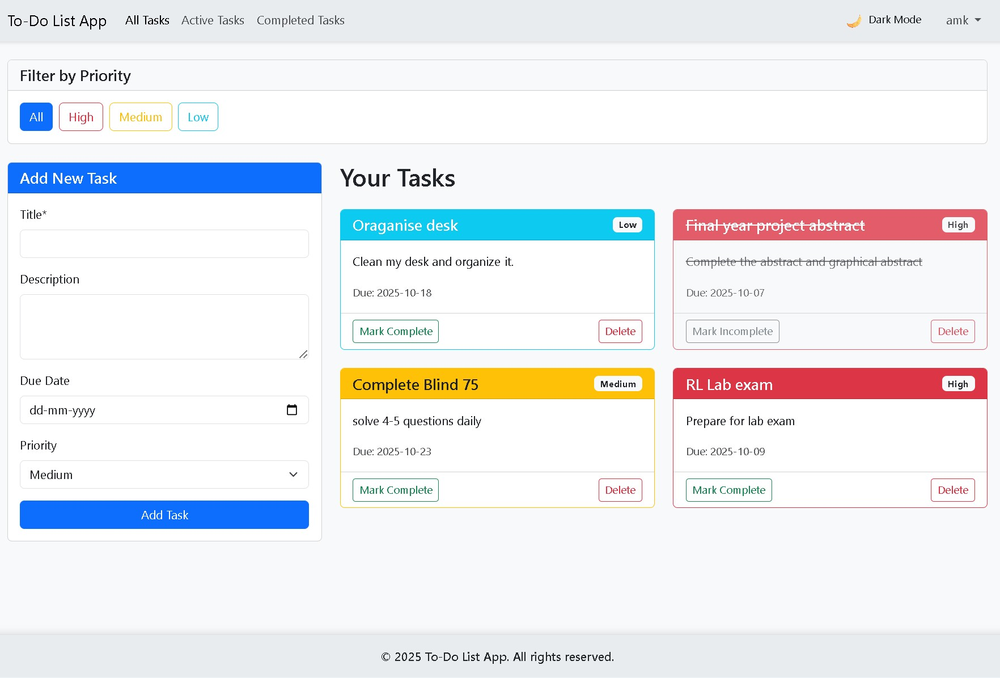
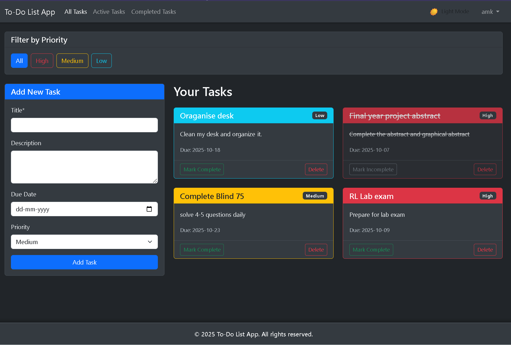
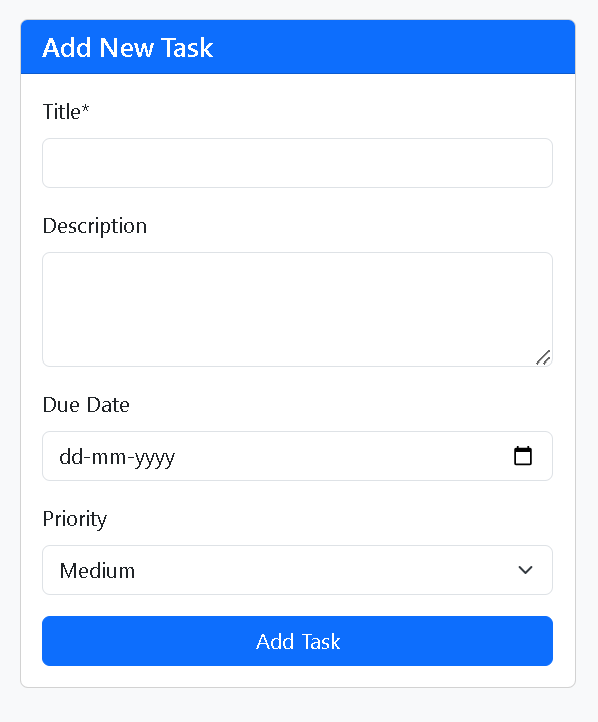
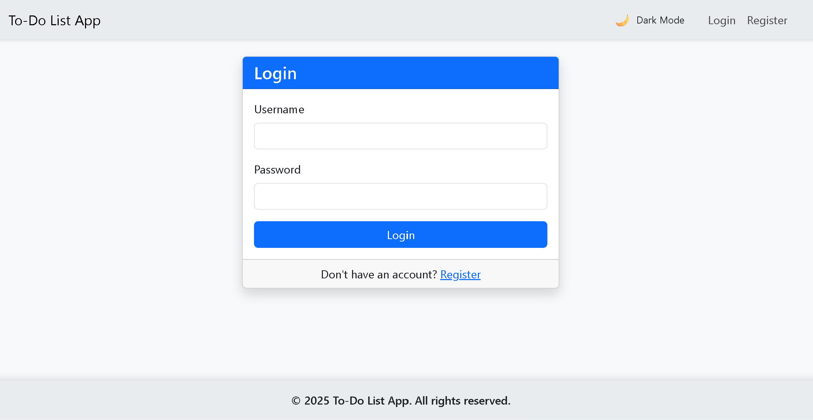

# To-Do List Web Application

A responsive web application for managing your tasks, built with HTML, CSS, Bootstrap 5, JavaScript, and Flask.


## Purpose

This application allows users to create, view, and delete tasks with different priorities and due dates. It demonstrates the use of modern web technologies and responsive design principles.

## Tech Stack

- **Backend**: Flask (Python)
- **Database**: SQLite
- **Frontend**: HTML5, Bootstrap 5, CSS
- **JavaScript**: jQuery for validation and UI effects
- **Templates**: Jinja2

## Features

- Responsive design that works on mobile and desktop
- Task management with title, description, due date, and priority
- Client-side form validation
- Confirmation dialogs before deletion
- UI effects (fade in/out, hover effects)
- Flash messages for user feedback
- Semantic HTML5 tags for better accessibility
- User authentication (login/register)
- Dark/light theme toggle
- Task filtering by priority
- Separate views for all, active, and completed tasks

## Screenshots

### Light Theme


*Home page with task list in light theme*

### Dark Theme


*Home page with task list in dark theme*

### Task Management


*Creating a new task with priority and due date*

### User Authentication


*User login interface*


## Project Structure

```
Full Stack Project/
├── project/
├── app.py                  # Main Flask application
├── requirements.txt        # Python dependencies
├── instance/              
│   └── tasks.db            # SQLite database (created on first run)
│   ├── static/
│   │   ├── css/
│   │   │   └── style.css   # Custom CSS styles
│   │   └── js/
│   │       └── script.js   # Custom JavaScript
│   └── templates/
│       ├── base.html       # Base template with layout
│       ├── index.html      # Home page with task form and list
│       └── success.html    # Success page after task creation
└── README.md              # This file
```

## Setup Instructions

1. Clone the repository using the git clone command

2. Install dependencies:
   ```
   pip install -r requirements.txt
   ```

3. Run the application:
   ```
   python app.py
   ```

4. Open your browser and navigate to:
   ```
   http://127.0.0.1:5000/
   ```
